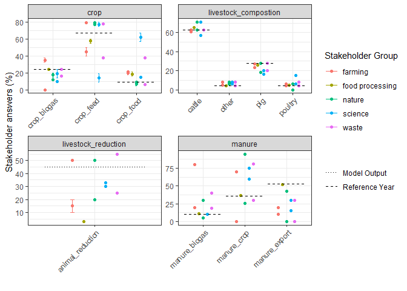
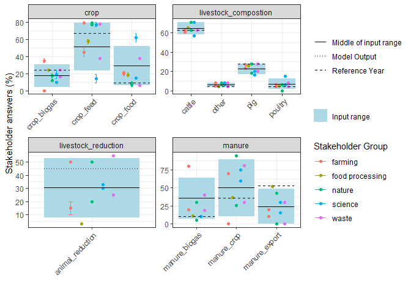
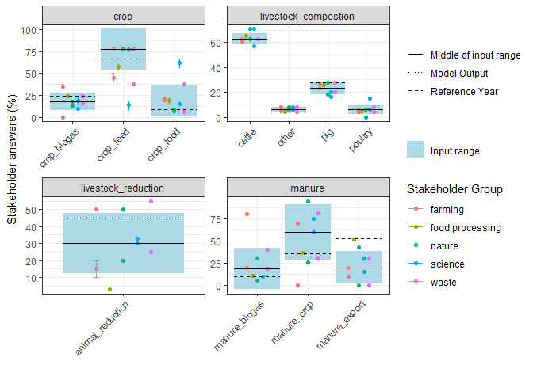
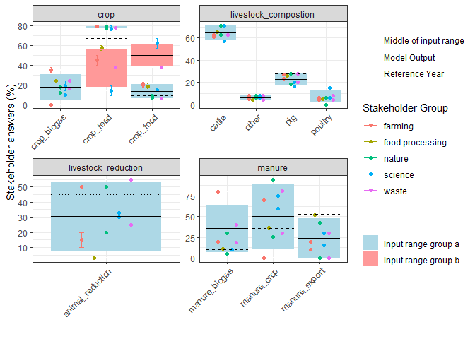
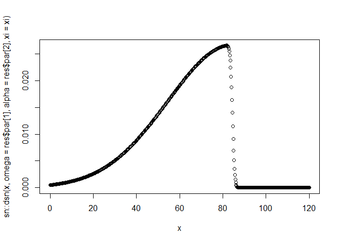
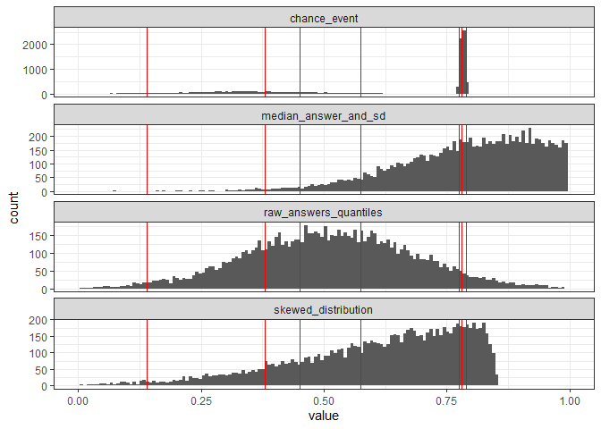

How to implement uncalibrated stakeholder input with small sample size
================
Lars Caspersen
2022-10-14

## Context

In a research project on nutrient flows in the district of Kleve,
Germany, several stakeholder coming from different industries (farmers,
waste treatment, environmentalists, food processing, scientists) were
interviewed. This is a follow-up project on a study were nutrient flows
in the agro-food-waste system of Kleve were mapped (van der Wiel et al.
2021). A simplified version of the outcomes can be seen for the example
of nitrogen flows in the figure below. The study was carried out on a
district level, boxes represent the studied subsystems. The system
boundaries are represented in the outer box. Flows between the subsystem
were collected from reports, expert estimates and model outputs. The
study investigated flows of nitrogen (N), phosphorous (P), potassium (K)
and to a lesser extent carbon (C). In the figure below the flows were
aggregated of numerous individual subsystem interactions, for more
details please refer to van der Wiel et al. (2021).


In the current project, the nutrient flow calculation were brought to R
and are probabilistic instead of deterministic. Furthermore, a scenario
deviating from the baseline calculations was included. Fore more details
on the model please have a look at the [GitHub
repo](https://github.com/larscaspersen/DA-nutrient-flow-Kleve)
Stakeholders were asked to give estimates on a theoretical scenario, in
which animals in Kleve are exclusively fed using locally sourced (within
Kleve) feed stuff. The stakeholder estimates were intended to be used as
input for a nutrient flow model on a district level. Questions tackled
(1) the allocation (%) of crop biomass to different parts of the
subsystems (biogas plants, feed for animals, human consumption), (2) the
composition (%) of animals measured in livestock units (for example one
dairy cow = \~72 egg-laying hens), (3) the overall change (%) in
livestock units and (4) the allocation (%) of manure to different
subsystems (biogas, application on fields, export to other districts).

Because of the Corona pandemic and more importantly the unwillingness of
major stakeholder (especially farmers union) having workshops in the
usual decision analysis-way were not possible. Instead, we opted to have
interviews with stakeholders willing to cooperate. These interviews had
several caveats: the stakeholders were not properly calibrated, the
stakeholders felt extremely uncomfortable to give estimates on these
extremely theoretical scenarios and often failed to give estimates in
ranges, they were anchored on the allocation in the reference year which
was mentioned in the questionnaire and finally, there was no second
workshop were stakeholders could give feedback on the collected ranges.

## Getting stakeholder estimates via questionnaires

We received only few answers and in most cases they were not given in
ranges. The following diagram shows the stakeholder estimates for the
four questions:

1)  In reference year 2020 around 67% of produced crops N which were not
    exported were used to feed animals. The remaining were used for
    local human consumption (9%) and biogas (24%). How do you think will
    these allocation change in a local feed scenario?
2)  In reference year 2020 the livestock composition (measured in
    livestock units) in Kleve was 64% cattle, 28% pig, 4% poultry and 4%
    other animals (horses, sheep, goats). How do you think the
    composition will change under a local feed scenario?
3)  In the reference year 2020 import of feed made up around 45% of the
    nitrogen allocated to animals in form of feed. In a local feed
    scenario this amount would be assumed to be missing, but changes in
    the allocation of crops could substitute parts of it. How strong do
    you expect the overall livestock population in Kleve to shrink in a
    local feed scenario?
4)  In a local feed scenario manure is more likely to become scarce. In
    the reference year 2020 around 53% of manure N was exported (most
    likely Kleve is a transit district for dutch manure, because imports
    are high as well), 36 % of manure N were applied as fertilizer on
    crops and 10% of manure N were used as biogas substrate. How do you
    think will these allocations change in response to the local feed
    scenario?

There are several problems with the design of the questionnaire I don’t
want to address in detail. But we can be pretty certain that we locked
the interviewed persons by giving them the reference numbers and some
questions (like question number 3) were already framed in a direction
towards animal reductions. But this is the best we could do at the time
and now we have to handle the results.

The diagram below tries to illustrate the answers of the stakeholders.
There is one panel for each question and the ticks at the x-axis
correspond to the items within the question. The y-axis shows the
answers in percent. If the stakeholders answered in a range, the dot
shows the mean and the errorbar the range, but in most cases they
didn’t. The color of the dots correspond to the role of the
stakeholders. Bernou interviewed people from the food processing
industry, farmers, people in the waste treatment industry, people
organised in environmental and nature conversation organizations and
scientists from the local university of applied sciences.

``` r
library(tidyverse)
answers <- read.csv('stakeholder_answers.csv')

head(answers)
```

    ##   stakeholder_code stakeholder_group              var middle upper lower
    ## 1                a            nature      crop_biogas     12    NA    NA
    ## 2                a            nature        crop_feed     79    NA    NA
    ## 3                a            nature        crop_food      9    NA    NA
    ## 4                a            nature animal_reduction     20    NA    NA
    ## 5                a            nature           cattle     71    NA    NA
    ## 6                a            nature              pig     18    NA    NA
    ##               category subgroup
    ## 1                 crop        a
    ## 2                 crop        a
    ## 3                 crop        a
    ## 4  livestock_reduction        a
    ## 5 livestock_compostion        a
    ## 6 livestock_compostion        a

``` r
#create data for of reference year
old_df <- answers[1:11,]
old_df$stakeholder <- c(rep('Reference Year',3), 'Model Output', rep('Reference Year', 7))
old_df$median <- c(24, 67, 9, 45, 63, 28, 4, 4, 53, 10, 36)


ggplot(answers, aes(x = var, y = middle)) + 
  geom_point(position=position_dodge(width=0.5), size = 1.5, aes(col = stakeholder_group)) +
  geom_errorbar(aes(ymin=lower, ymax=upper, col = stakeholder_group), width=.2,
                position=position_dodge(0.5))+
  geom_segment(data = old_df, aes(
    x = c(1:3,1 , 1,3,2,4, 3,1,2) - .45,
    xend = c(1:3,1, 1,3,2,4, 3,1,2) + .45,
    y = median,
    yend = median,
    linetype = stakeholder), col = 'black')+
  facet_wrap(~category, scales = 'free') +
  scale_linetype_manual("", values = c(3,2)) +
  ylab('Stakeholder answers (%)') +
  xlab('') +
  theme_bw() +
  labs(colour='Stakeholder Group')+
  theme(axis.text.x = element_text(angle = 45, vjust = 1, hjust = 1))
```

<!-- -->

You can see that in some cases, like livestock_composition, the answers
are tightly clustered around the provided reference year values, a
classical example of anchoring. For some questions the stakeholders had
very different ideas, like in the facet for manure allocation. It seems
that the answers are evenly spread across a certain interval. Some
trends can be seen, for example most of the stakeholders expect a lower
degree of manure export, they just couldn’t “agree” on the exact level.
But in some cases the stakeholders have completely different ideas about
the impact of the scenario. For example, the facet for crop allocation
(top left) shows drastically different ideas. There is one group of
stakeholders that expect and increase in crops allocated to feed and
there is a second, somewhat more dispersed group of stakeholders who
expect moderate to drastic reductions. And at the same time they expect
a drastic increase in crop allocated to humans. And by the way, we can
also see that stakeholders were not really consistent in their answers.
For example the stakeholder who expects only 10 - 20% of crops allocated
to animals only expects a 30% reduction in livestock population. That
seems to not add up… In general I was surprised to see a lack of “story”
in most of the stakeholders answers, except for the “take feed and give
it to humans”-trend. Probably the scenario was too abstract and the task
was too difficult to give answers which are consistent with each other.

## The challenge

Aside from the biases in the stakeholder answers I described earlier,
there are other problems when integrating these answers in a model.
First of all, the decisionSupport package needs the 5% and 95% quantiles
and not some mean estimates and by the way, even the stakeholders who
managed to give ranges probably did not give ranges for these exact
quantiles. This shows how important calibration really is! How can I
translate these answers into a decisionSupport conformative way? The
first idea was to simply take the 5% and 95% quantiles of the answers.
But as you can see, there aren’t a lot answers (nine to be precise) so
the quantiles are not really meaningful. The blue areas in the plot
below show the input ranges of that approach

``` r
#summarise stakeholder input median
answers_summarised <- answers %>% 
  group_by(var, category) %>% 
  summarise(lower = quantile(middle, 0.05),
            upper = quantile(middle, 0.95)) %>% 
  mutate(middle = (upper + lower) / 2)
```

    ## `summarise()` has grouped output by 'var'. You can override using the `.groups`
    ## argument.

``` r
#this needed to draw shaded areas in the plot
answers_summarised$xmin <- c(1,1,1,2,3,1,2,3,2,3,4) - 0.45
answers_summarised$xmax <- c(1,1,1,2,3,1,2,3,2,3,4) + 0.45

ggplot(answers, aes(x = var)) + 
  facet_wrap(~category, scales = 'free') +
  geom_point(size = 0.001, aes(y = middle), col = 'white')+
  geom_rect(data = answers_summarised, aes(xmin = xmin, xmax = xmax, ymin =lower, 
                                           ymax = upper, group = var, 
                                           fill = 'Input range')) +
  geom_point(position=position_dodge(width=0.5), size = 1.5, aes(col = stakeholder_group, y = middle)) +
  geom_errorbar(aes(ymin=lower, ymax=upper, col = stakeholder_group), width=.2,
                position=position_dodge(0.5))+
  geom_segment(data = old_df, aes(
    x = c(1:3,1 , 1,3,2,4, 3,1,2) - .45,
    xend = c(1:3,1, 1,3,2,4, 3,1,2) + .45,
    y = median,
    yend = median,
    linetype = stakeholder), col = 'black')+
  geom_segment(data = answers_summarised, aes(
    x = xmin,
    xend = xmax,
    y = middle,
    yend = middle,
    linetype = 'Middle of input range'))+
  scale_linetype_manual("", values = c(1,3,2)) +
  scale_fill_manual("", values = c('lightblue')) +
  ylab('Stakeholder answers (%)') +
  xlab('') +
  theme_bw() +
  labs(colour='Stakeholder Group')+
  theme(axis.text.x = element_text(angle = 45, vjust = 1, hjust = 1))
```

<!-- -->

Overall this looks okayish, but have a look at the middle of the input
range for the crops allocated to feed. The clustered answers indicating
an increase are at the range of the distribution (which is normal
distributed). This could lead to some issues…

Another idea Bernou and I had was to take the median of the answers and
use the median +/- standard deviaion of the answers as an input range.

``` r
#summarise stakeholder input median
answers_summarised <- answers %>% 
  group_by(var, category) %>% 
  summarise(sd_answer = sd(middle),
            middle = median(middle)) %>% 
  mutate(upper = middle + sd_answer,
         lower = middle - sd_answer)
```

    ## `summarise()` has grouped output by 'var'. You can override using the `.groups`
    ## argument.

``` r
#this needed to draw shaded areas in the plot
answers_summarised$xmin <- c(1,1,1,2,3,1,2,3,2,3,4) - 0.45
answers_summarised$xmax <- c(1,1,1,2,3,1,2,3,2,3,4) + 0.45

ggplot(answers, aes(x = var)) + 
  facet_wrap(~category, scales = 'free') +
  geom_point(size = 0.001, aes(y = middle), col = 'white')+
  geom_rect(data = answers_summarised, aes(xmin = xmin, xmax = xmax, ymin =lower, 
                                           ymax = upper, group = var, 
                                           fill = 'Input range')) +
  geom_point(position=position_dodge(width=0.5), size = 1.5, aes(col = stakeholder_group, y = middle)) +
  geom_errorbar(aes(ymin=lower, ymax=upper, col = stakeholder_group), width=.2,
                position=position_dodge(0.5))+
  geom_segment(data = old_df, aes(
    x = c(1:3,1 , 1,3,2,4, 3,1,2) - .45,
    xend = c(1:3,1, 1,3,2,4, 3,1,2) + .45,
    y = median,
    yend = median,
    linetype = stakeholder), col = 'black')+
  geom_segment(data = answers_summarised, aes(
    x = xmin,
    xend = xmax,
    y = middle,
    yend = middle,
    linetype = 'Middle of input range'))+
  scale_linetype_manual("", values = c(1,3,2)) +
  scale_fill_manual("", values = c('lightblue')) +
  ylab('Stakeholder answers (%)') +
  xlab('') +
  theme_bw() +
  labs(colour='Stakeholder Group')+
  theme(axis.text.x = element_text(angle = 45, vjust = 1, hjust = 1))
```

<!-- -->

Again, looks for most questions fine. Some of the more extreme answers
are not represented anymore by the input range. Furthermore, some new
areas which were not represented by stakeholder answers are now covered
by the input range, as you can see for the example crop allocated to
feed. This is also not ideal. We loose some of the answers and add new
ranges not indicated by the stakeholders.

Another idea was to split the problematic stakeholder answers into two
groups and model them independently. One could for example split the
crop allocated to feed into the group of stakeholders expecting increase
in crops allocated to crops and another one for decrease. Similarly, we
could split the answers for crops allocated to humans, we could have a
group of moderate change and one group expecting strong increase. The
second split is a little bit less well balanced, though. We could leave
things as they are for the other groups because there it is more
difficult to see distinct groups of answers. We could insert the
stakeholder answer ranges per group in the input table and then link
them in a `chance_event()` function. The chance variable could be the
proportion of stakeholders belonging to a group for example. This link
would effectively create a bi-modal distribution. Thanks to Johannes
Kopton, who suggested this approach to me.

``` r
#add groups to the input table


#summarise stakeholder input median
answers_summarised <- answers %>% 
  group_by(var, category, subgroup) %>% 
  summarise(lower = quantile(middle, 0.05),
            upper = quantile(middle, 0.95),
            n = n()) %>% 
  mutate(middle = (upper + lower) / 2,
         group_weight = n / 9)
```

    ## `summarise()` has grouped output by 'var', 'category'. You can override using
    ## the `.groups` argument.

``` r
#this needed to draw shaded areas in the plot
answers_summarised$xmin <- c(1,1,1,2,2,3,3,1,2,3,2,3,4) - 0.45
answers_summarised$xmax <- c(1,1,1,2,2,3,3,1,2,3,2,3,4) + 0.45

ggplot(answers, aes(x = var)) + 
  facet_wrap(~category, scales = 'free') +
  geom_point(size = 0.001, aes(y = middle), col = 'white')+
  geom_rect(data = answers_summarised[answers_summarised$subgroup == 'a',], aes(xmin = xmin, xmax = xmax, ymin =lower, 
                                           ymax = upper, group = var, 
                                           fill = 'Input range group a')) +
    geom_rect(data = answers_summarised[answers_summarised$subgroup == 'b',], aes(xmin = xmin, xmax = xmax, ymin =lower, 
                                           ymax = upper, group = var, 
                                           fill = 'Input range group b')) +
  geom_point(position=position_dodge(width=0.5), size = 1.5, aes(col = stakeholder_group, y = middle)) +
  geom_errorbar(aes(ymin=lower, ymax=upper, col = stakeholder_group), width=.2,
                position=position_dodge(0.5))+
  geom_segment(data = old_df, aes(
    x = c(1:3,1 , 1,3,2,4, 3,1,2) - .45,
    xend = c(1:3,1, 1,3,2,4, 3,1,2) + .45,
    y = median,
    yend = median,
    linetype = stakeholder), col = 'black')+
  geom_segment(data = answers_summarised, aes(
    x = xmin,
    xend = xmax,
    y = middle,
    yend = middle,
    linetype = 'Middle of input range'))+
  scale_linetype_manual("", values = c(1,3,2)) +
  scale_fill_manual("", values = c('lightblue', '#FF9999')) +
  ylab('Stakeholder answers (%)') +
  xlab('') +
  theme_bw() +
  labs(colour='Stakeholder Group')+
  theme(axis.text.x = element_text(angle = 45, vjust = 1, hjust = 1))
```

<!-- -->

Okay this plot is getting a bit loaded but bear with me. There are again
some drawbacks to this approach. The area in between the groups is not
really well represented, there is no reason for us to believe that there
won’t be anything in the gaps. Also the upper group in crops allocated
to feed looks really clustered.

Another idea would be to have skewed distributions, instead of normal
ones. This way we could acknowledge what most stakeholder expect to see
without loosing the more “extreme” answers. Unfortunately, there is no
routine within the decisionSupport package that can handle that. But I
played around a little bit and I found a way to add this to your own
model function (but I don’t know how to add this to the decisionSupport
package).

``` r
library(sn) #package to handle skewed distributions within R

#this approach was adopted from a post on stack exchange, but I can't find the post anymore
#the idea is to find a skewed distribution, which describes the given quantiles and mean the best
#the function returns the residual sum of squares for the observed quantiles and calculated quantiles for
#the fitted distribution
#the goal is to find the parameters xi, omega and alpha, which describe a skewed normal distribution
model <- function(x, parms) {
  omega = x[1]
  alpha = x[2]
  m = parms[1]
  p05 = parms[2]
  p95 = parms[3]
  xi = m - omega*alpha*sqrt(2/(pi*(1+alpha^2)))
  
  return ((p05 - qsn(0.05, xi, omega, alpha))^2 +
          (p95 - qsn(0.95, xi, omega, alpha))^2)
  
  
}

#we take the quantiles and mean from the answer we are interested in
q05 <- quantile(answers$middle[answers$var == 'crop_feed'], 0.05)
q95 <- quantile(answers$middle[answers$var == 'crop_feed'], 0.95)
m <- mean(answers$middle[answers$var == 'crop_feed'])

#we use an aoptimzation function to find the set of parameters which give the lowest
#error. We also need to provide lower and upper bounds (which I chose more or less randomly)
#and we need to define a search method (I also chose something random, to be honest)
res <- optim(par = c(12, 1), fn = model, parms = c(m, q05, q95), method = "Nelder-Mead", 
      lower = c(0.01, -1000), upper = c(1000,1000))
```

    ## Warning in optim(par = c(12, 1), fn = model, parms = c(m, q05, q95), method =
    ## "Nelder-Mead", : bounds can only be used with method L-BFGS-B (or Brent)

``` r
#we calculate the parameter xi for the results
xi <- (m - res$par[1]*res$par[2]*sqrt(2/(pi*(1+res$par[2]^2))))


#here is a plot of the fitted distribution
x <- seq(0, 120, by=0.2)
plot(sn::dsn(x, omega = res$par[1], alpha = res$par[2], xi = xi), x = x)
```

<!-- -->

This could be promising. I decided to compare the different
distributions resulting from the different processing approaches.

``` r
#here is an example for the crops allocated to feed

#number of random draws, usually is 10,000
nsim <- 10000

raw_quantiles <-  decisionSupport::rtnorm_0_1_90ci(n = nsim, 
                                                   lower = quantile(answers$middle[answers$var == 'crop_feed'], 0.05) / 100,
                                                   upper = quantile(answers$middle[answers$var == 'crop_feed'], 0.95) / 100,
                                                   correlationMatrix = 1)

#calculate median, standard deviation
med <- median(answers$middle[answers$var == 'crop_feed']) / 100
sd <- sd(answers$middle[answers$var == 'crop_feed'] / 100) 
upper <- ifelse(med + sd > 0.98, yes = 0.98, no = med + sd)
lower <- ifelse(med - sd < 0.01, yes = 0.01, no = med - sd)

#using median and plus minus sd
sd_way <- decisionSupport::rtnorm_0_1_90ci(n = nsim, lower = lower, upper = upper ,correlationMatrix = 1)

#create distribution for skewed distribution
skewed_way <- sn::rsn(n = nsim, xi = xi, omega = res$par[1], alpha = res$par[2])


#split groups and link with chance event

#caluclate upper and lower boundary of the two groups
upper_g1 <- max(answers$middle[answers$var == 'crop_feed' & answers$subgroup == 'a']) / 100
lower_g1 <- min(answers$middle[answers$var == 'crop_feed' & answers$subgroup == 'a']) / 100
upper_g2 <- max(answers$middle[answers$var == 'crop_feed' & answers$subgroup == 'b']) / 100
lower_g2 <- min(answers$middle[answers$var == 'crop_feed' & answers$subgroup == 'b']) / 100

#draw numbers for both groups independently
g1 <- decisionSupport::rtnorm_0_1_90ci(n = nsim, lower = lower_g1, upper = upper_g1 ,correlationMatrix = 1)
g2 <- decisionSupport::rtnorm_0_1_90ci(n = nsim, lower = lower_g2, upper = upper_g2 ,correlationMatrix = 1)

#weight of group1
weight_g1 <- length(answers$middle[answers$var == 'crop_feed' & answers$subgroup == 'a']) / length(answers$middle[answers$var == 'crop_feed'])

#object to store the final result
chance_way <- c()

for(i in 1:nsim){
  chance_way[i] <- decisionSupport::chance_event(weight_g1, value_if = g1[i], value_if_not = g2[i])
}


#bind everything to one data.frame
dist_df <-  rbind(data.frame(value = chance_way, type = 'chance_event'),
data.frame(value = skewed_way / 100, type = 'skewed_distribution'),
data.frame(value = raw_quantiles, type = 'raw_answers_quantiles'),
data.frame(value = sd_way, type = 'median_answer_and_sd'))

#visualize the distribution
ggplot(dist_df, aes(x = value)) + 
  geom_histogram(bins = 150) + 
  geom_vline(xintercept = answers$middle[answers$var == 'crop_feed'] / 100, col = 'red')+
  facet_wrap(~type, scales = 'free_y', ncol = 1, nrow = 4) + 
  xlim(0,1) + 
  theme_bw()
```

    ## Warning: Removed 46 rows containing non-finite values (stat_bin).

    ## Warning: Removed 8 rows containing missing values (geom_bar).

<!-- -->

The figure above shows the distributions that result from the different
approaches to integrate the raw stakeholder estimations. The answers of
the stakeholders are represented by red vertical lines, the
distributions are shown in the histogram. Each approach has some
advantages and disadvantages. The chance event approach with splitting
the stakeholder answers into groups makes sure that each answer is
represented and that the groups with larger consensus among the
stakeholder also gets more weight. But there are several problems: the
right hand group seems to have little variation because the answers were
tightly clustered. I think the variation and uncertainty is not well
captured in this group. But the more concerning characteristic of this
approach is the space between the two groups. In the context of the
question it does not make sense, that the values from around 0.6 and 0.7
are not represented at all.

The median +/- sd approach was more of a desperate idea, because it
reduces the influence of the more extreme answers without loosing them
completely. It is nice to see, that the peak of the distribution lies
close to the right hand cluster where the majority of the stakeholder
answers lied. The scattered answers on the left hand side were also
reasonably well captured, except maybe the most left one. However, it is
concerning to see. that a large chunk of the distribution lies where no
of the answers are, especially on the interval of 0.8 to 1.

The “raw_answers_quantiles” approach was how we initially planned to
integrate the answers. This might work well if you have many answers,
but we ended up having only 9… The right hand side group were most
answers lied is not well captured, it is at the upper tail of the
distribution now. Instead, the peak is located in an area were few
answers lie. This is a really unsatisfying outcome.

Luckily we had a fourth idea, the skewed distribution approach. This is
not implemented in the decisionSupport package, though. The peak of the
distribution is at the right hand answer group. The more extreme and
scattered answers are also captured on the left with an gradual increase
towards the right hand side. Soon after the right hand group the
distribution steeply declines at around 0.8. I like the values between
the groups is reasonably well captured and that the values far to the
right were non of the answers lied are not captured, unlike for example
in “median_answer_and_sd”. The skewed distribution approach seems to me
like the best compromise, the trend is captured without loosing the more
extreme answers.

## Outlook

Right now the skewed distribution approach is not part of the
decisionSupport package. Integrating it requires some programming
effort, especially because the package works with classes and I don’t
have any experience with that. Instead I will probably fit the
distributions in a separate script for each question, were I think that
the “raw_answer_quantile” approach failed. The fitted parameters can be
part of the input file, probably as a constant. Then I will draw in the
beginning of the decision model a random value from the fitted
distribution. The downside is, that the drawn value is not part of the
input values of the mcSimulation object (and thus they are not part of
any post-hoc analysis).

## References

<div id="refs" class="references csl-bib-body hanging-indent">

<div id="ref-van2021restoring" class="csl-entry">

van der Wiel, Bernou Zoë, Jan Weijma, Corina Everarda van Middelaar,
Matthias Kleinke, Cees Jan Nico Buisman, and Florian Wichern. 2021.
“Restoring Nutrient Circularity in a Nutrient-Saturated Area in Germany
Requires Systemic Change.” *Nutrient Cycling in Agroecosystems* 121 (2):
209–26. <https://doi.org/10.1007/s10705-021-10172-3>.

</div>

</div>
